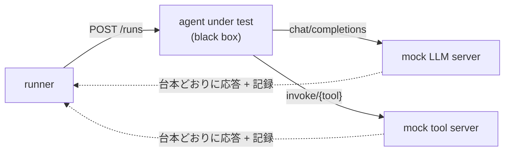

# agent-koans

AI エージェント実装のためのコンフォーマンステストスイート。モデルを完全にモックした状態で、エージェント「実装」の側だけを決定論的に検証する。koan（公案）は YAML で書かれた宣言的なテストで、タスク・台本化された会話・期待される結末からなる。

## eval では実装のバグを切り分けられない

エージェントがおかしな振る舞いをしたとき、原因はモデルか、プロンプトか、自分のコードか。eval はこの3つをまとめて測るので切り分けられない。agent-koans はモデルとプロンプトを固定してしまうことで、**koan が落ちたら必ず実装のバグ**という状態を作る。逆にモデルの能力は測らない。そこは eval の仕事、と役割を分けている。

検証の対象になっているのは、引数のバリデーション、失敗からの復帰、委譲、コンテキストの扱い、終了条件といった、モデルの賢さとは独立した部分。

## 実行のかたち

テスト対象のエージェントは HTTP サーバとして実装する。ランナーは koan ごとにエージェントを起動し、両側から観察する。



モックは koan が書いた台本どおりに応答しつつ、エージェントが何を送ってきたかを記録する。検査の大半はこの記録に対して行われる。モデルへのリクエストを何回投げたか、ツールにどんな引数が届いたか、各ステップで会話に何が載っていたか。

エージェント側の HTTP インターフェイスは `openapi.yaml` が、koan ファイルに書ける内容は `src/koan-spec.ts` が定義していて、`SPEC.md` より厳密なこの2つが優先される。

## 文言ではなく値を見る

会話の中身に対する検査は、**モックが台本に書いた値そのもの**を探す。特定の言い回しは要求しない。たとえば「ツールの失敗がモデルに伝わったか」を見る koan は、ステータスコードやエラー本文のテキストが会話に含まれているかを見る。だからエラーメッセージの表現は実装者の自由で、日本語でも構わない。

これは仕様を「振る舞いの契約」に閉じ込めるやり方として綺麗だと思う。

## skip には理由が要る

`agent-koans.yaml` で koan をスキップできるが、**理由が必須**になっている。

```yaml
skip:
  009-scalar-mismatch: "pi-ai coerces scalars before validation (upstream #12)"
add:
  - ./my-koans
```

理由を書かせることで、スキップが黙って腐るのを防いでいる。

独自 koan を追加すると id にディレクトリ名が前置され（`my-koans/001-refund-idempotency`）、サマリでも別扱いになる。公開スイートに対するコンフォーマンス主張と、自前のテストが混ざらないようにするための設計。適合を主張するときはスイートのバージョンを明記する（"conforms to agent-koans 1.x"）。

## 理解度チェック

```quiz
agent-koans が「koan が落ちたら必ず実装のバグ」と言い切れるのはなぜか。
---
モデルとプロンプトを台本で固定してモックするから。eval はモデル・プロンプト・実装の3つをまとめて測るので、原因を切り分けられない。
```

```quiz
koan の検査は、会話の中身について何を見て、何を見ないか。
---
モックが台本に書いた値（ステータスコードやエラー本文）が会話に含まれるかを見る。特定の言い回しは要求しないので、エラーメッセージの表現は実装者の自由。
```

## 出典

- [piconic-ai/agent-koans](https://github.com/piconic-ai/agent-koans)
- `SPEC.md` — コンフォーマンス契約。リポジトリの実体はテストコードではなくこの文書

#ai-agent #testing #conformance
