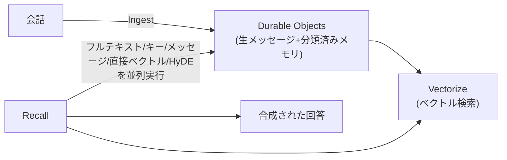

# Cloudflare Agent Memory

AI エージェントに永続的な記憶を持たせるマネージドサービス。[[cloudflare-agents-week-2026]] の中で発表され、発表時点ではプライベートベータ。

## 何を解決するか

モデルの出力品質はコンテキストの質に依存するが、コンテキストを詰め込みすぎると劣化する("context rot")。開発者は「すべてをコンテキストに残して品質低下を受け入れるか、積極的に削って必要な情報まで失うか」という二択に置かれていた、というのが課題認識。Agent Memory は、エージェントが「重要なことは思い出し、不要なことは忘れ、時間とともに賢くなる」ことを目指した設計。

## profile という単位

profile は名前で指定されるメモリストアで、セッション・エージェント・ユーザーをまたいで共有できる。テナントごとに強く隔離されている。

## 5つの操作

| 操作 | 内容 |
| --- | --- |
| Ingest | 会話からメモリを抽出する。通常はコンテキスト圧縮のタイミングで呼ばれる |
| Remember | モデルが重要な情報を直接保存する |
| Recall | 検索パイプライン全体を実行し、合成された回答を返す |
| List | 保存されているメモリを一覧する |
| Forget | 不要・誤りとしてメモリにマークする |

## 内部の実装

- **Durable Objects**: 生のメッセージと分類済みのメモリを保存(SQLite バックエンド)
- **Vectorize**: ベクトル検索を担当
- **Workers AI**: LLM と埋め込みモデルの実行を担当

抽出パイプラインは、事実・イベント・指示・タスクという分類でメモリを整理する。検索(Recall)は、フルテキスト・キー検索・メッセージ検索・直接ベクトル検索・HyDE という5つのチャネルを並列に実行する構成になっている。



Cloudflare Agents SDK の Sessions API における、メモリ部分の参照実装として統合される(圧縮・記憶・メモリ検索を担当)。

## [[cloudflare-agents-week-2026]]の中での位置づけ

エージェントの記憶を扱う。検索は [[cloudflare-ai-search]]、実行環境は [[cloudflare-sandboxes]] に分けた。

## 理解度チェック

```quiz
Agent Memory が解決しようとしている "context rot" のジレンマとは何か。
---
コンテキストに情報を詰め込みすぎると品質が劣化する一方、積極的に削ると必要な情報まで失う、という開発者が直面していた二択のこと。
```

```quiz
Recall 操作は内部でどう検索しているか。
---
フルテキスト検索・キー検索・メッセージ検索・直接ベクトル検索・HyDEという5つのチャネルを並列に実行し、結果を合成して返す。
```

## 出典

- [Agents that remember: introducing Agent Memory](https://blog.cloudflare.com/introducing-agent-memory/)
- [Building the agentic cloud: everything we launched during Agents Week 2026](https://blog.cloudflare.com/agents-week-in-review/)

#cloudflare #agents-week-2026 #ai-agent
