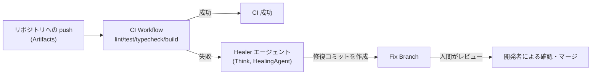

# Cloudflare CI/CD (@cloudflare/ci)

数百万リポジトリを対象にした、コードで定義する CI/CD パイプライン。パッケージ名は `@cloudflare/ci`。2026年8月4日、[[cloudflare-agents-week-2026]] で [[agent-development-lifecycle]] と同じ日に発表された。

## 解決しようとしている問題

GitHub Actions のような YAML ベースの CI/CD 設定は、複雑になるとすぐに扱いづらくなる、というのが出発点の問題意識。特に「プラットフォームが数百万のリポジトリに対して CI/CD を提供し、かつ顧客ごとに異なるニーズに対応する」というスケールでは、YAML の表現力の限界が顕著になる。解決策として、CI パイプラインを TypeScript のコードとして書けるようにした。

## アーキテクチャ

4つの既存プリミティブの組み合わせで構成される。

| 部品 | 役割 |
| --- | --- |
| [[cloudflare-sandboxes\|Artifacts]] | 数百万リポジトリを保存する versioned code storage |
| Cloudflare Workflows | CI パイプライン全体のオーケストレーション層(ステップの連鎖・再試行・状態永続化) |
| Sandbox SDK | 各 CI ステップを実行する隔離環境 |
| CI SDK (`@cloudflare/ci`) | 上記を CI 向けの薄い API にまとめたパッケージ |

記事の主張は「CI/CD パイプラインは単なる Workflow に過ぎない。しかし Workflow は CI/CD パイプライン以上のものになれる」というもの。Workflow は本来、複数ステップを連鎖させ、失敗したタスクを自動再試行し、状態を数分〜数週間にわたって永続化できる汎用の実行エンジンであり、CI/CD はその応用例の一つという位置づけになっている。

```typescript
const deps: CiRunnerResult = await ci.runner({
  name: 'install',
  command: 'bun install --frozen-lockfile',
  cache: { inputs: ['package.json', 'bun.lock'] },
});

await Promise.all([
  deps.runner({ name: 'lint', command: 'bun run lint' }),
  deps.runner({ name: 'test', command: 'bun run test' }),
  deps.runner({ name: 'typecheck', command: 'bun run typecheck' }),
  deps.runner({ name: 'build', command: 'bun run build' }),
]);
```

依存関係のインストール結果はキャッシュされ(R2 にスナップショット保存)、後続の `lint` / `test` / `typecheck` / `build` は `Promise.all()` で並列実行される。トリガーは `wrangler.json` 側で `cf.artifacts.repo.pushed` のようなイベントを Workflow に紐づけて設定する。

Workflows 上に構築されているため、失敗したステップだけの再試行、ステップ単位のカスタムタイムアウト・リトライ、Workflows ダッシュボードでのステップごとの可視化(入出力・実行時間)、GraphQL 経由でのログ取得といった Workflows の機能がそのまま CI/CD にも使える。

## 自己修復(self-healing)

CI ステップが失敗すると、`HealingAgent` を継承したエージェント(記事内の例では `Think` エージェント)が呼び出され、失敗を自動修復するコミットを別ブランチに作成する。元の CI 実行自体は失敗のまま残り、修復コミットは人間のレビュー・マージ待ちになる。エージェントが直接 main にマージすることはない。

```typescript
export class Healer extends HealingAgent {
  getModel() {
    return '@cf/moonshotai/kimi-k2.7-code';
  }
}
```

```typescript
try {
  // 通常の CI ステップ実行
} catch (failure) {
  if (!isCiRunnerFailure(failure)) throw failure;

  const healed = await step.do(
    'heal',
    { retries: { limit: 0, delay: 0 }, timeout: '5 hours' },
    async () => {
      const healer = await getAgentByName(this.env.HEALER, event.instanceId);
      using result = await healer.heal({
        failure: enrichFailure({ failure, event, baseBranch }),
        prompt: 'Fix every observed failure without weakening validation.',
      });
      return { branch, commit, steps };
    },
  );
  throw new CiRunFailedWithFix(failure, healed);
}
```



## 発表時点での提供状況

2026年8月4日の発表時点で、基盤となる Artifacts はプライベートベータ。参加にはフォーム申請が必要だった。

## 今後の計画(記事内の言及)

- `build.preview()` / `build.deploy()` — push だけで自動デプロイ・プレビュー作成するプリミティブ
- 段階的ロールアウト(gradual deployments)
- モノレポ対応
- Artifacts 以外のバージョン管理システムからのトリガー対応

## [[agent-development-lifecycle]] との関係

`@cloudflare/ci` は ADLC の記事自身が名指しで導入しているツールで、記事は「本日、エージェントがコード生成を超えて SDLC のより多くを担えるようにする、新しい一連のツールを紹介する」という文脈で、その筆頭に `@cloudflare/ci` を挙げている。記事のメタ説明も「ADLC と、それを支える Cloudflare のプリミティブを紹介する」としており、`@cloudflare/ci` はここでいう「プリミティブ」の一つとして明示的に位置づけられている。ADLC 記事本文からは `@cloudflare/ci` の紹介記事(この記事)への直接リンクが4箇所ある。

一方、この CI/CD 記事自身の本文には「ADLC」「Agent Development Lifecycle」という語は出てこない。ブログのタグも `Agents` / `Agents Week` / `AI` / `Developer Platform` / `Developers` / `Product News` / `Workflows` であり、`Agent Development Lifecycle` タグは付いていない(ADLC 記事側には `Agent Development Lifecycle` タグが付いている)。関係を明言しているのは ADLC 記事側だけ、という一方向の参照になっている。

## [[cloudflare-agents-week-2026]]の中での位置づけ

プロトタイプから本番へ、というテーマの中で、[[agent-development-lifecycle]] を支える具体的なプリミティブの一つ。保存層は Artifacts([[cloudflare-sandboxes]] と同じ週に発表された Git 互換ストレージ)、実行環境は Sandbox SDK([[cloudflare-sandboxes]] の基盤と共通)が担う。

## 理解度チェック

```quiz
@cloudflare/ci の自己修復機能は、CI が失敗したときに何をするか。main に直接コミットするのか。
---
Healer エージェントが失敗を修復するコミットを別のブランチ(Fix Branch)に作成する。元の CI 実行は失敗のまま残り、修復は人間のレビュー・マージ待ちになる。main への直接コミットはしない。
```

```quiz
ADLC の記事は @cloudflare/ci をどう位置づけているか。逆に、CI/CD の記事側は ADLC にどう言及しているか。
---
ADLC の記事は @cloudflare/ci を「ADLC を支えるプリミティブ」の一つとして名指しで紹介し、4箇所からリンクしている。一方 CI/CD の記事本文には「ADLC」という語も、対応するブログタグも一切出てこない。関係の明言は ADLC 側からの一方向。
```

## 出典

- [Run CI/CD for millions of repos — on your platform, on Cloudflare](https://blog.cloudflare.com/ci-workflows/)
- [The Agent Development Lifecycle has arrived on Cloudflare](https://blog.cloudflare.com/agent-development-lifecycle/)

#cloudflare #agents-week-2026 #ai-agent
