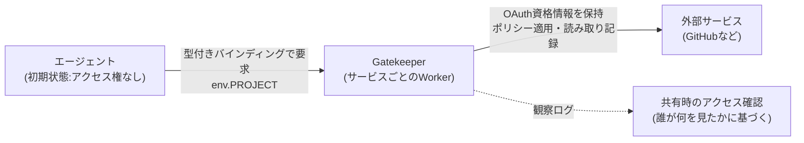

# Cloudflare OS

社員一人ひとりに、自社のコンテキスト(用語・手続き・使っているシステム)を理解したエージェントとワークスペースを与えるプラットフォーム。Cloudflare が社内で運用してきたものを、2026年8月5日、[[cloudflare-agents-week-2026]] でオープンソース化した。

同じ日に2本の記事が公開されている。

- [Cloudflare OS: an open platform for agents, apps, and work](https://blog.cloudflare.com/cloudflare-os/) — プラットフォームそのものの紹介・オープンソース化の発表(Phillip Jones, Dan Carter)
- [How we're rethinking work at Cloudflare with Cloudflare OS](https://blog.cloudflare.com/how-we-use-ai-with-cloudflare-os/) — 社内でどう作り、どう使われているかの記録(Sam Rhea, Cloudflare CIO)

## 三つの構成要素

1. **エージェントワークスペース** — 組織が用意したコンテキスト・スキルに基づいて動く、ブラウザ上のエージェントセッション。コードを書いて実行できる隔離ランタイムを持つ
2. **セキュリティ・ガバナンスフレームワーク** — Gatekeepers による、外部サービスへのきめ細かいアクセス制御
3. **個人が改変できるアプリ基盤** — エージェントが書いたアプリを、ドキュメントのように私有・共有できる

会話から始まり、その結果がドキュメント・アプリ・ワークフローへと発展していく、という流れになっている。

## セキュリティモデル

課題として挙げられているのは、「AI にAPIキーをそのまま渡す」やり方の限界。キーは範囲が広く長期間有効で、制約・安全な共有・監査が難しい。MCP サーバーは資格情報を隠して定義済みツールだけを公開できるが、それだけでは「エージェントがどのリソースを見たか」までは追跡できない、という限界も指摘されている。

- **エージェントは初期状態でアクセス権を一切持たない**。リソースへのアクセスは `env.PROJECT` のような型付きバインディングとして明示的に付与する
- **Gatekeepers** — 外部サービスごとに用意される Worker。サービスの API・リソース・操作を理解しており、たとえば GitHub 全体ではなく特定リポジトリだけ、ソースコードは読めないが issue は読める、特定フィールドをマスクする、マージ前に承認を必須にする、といった粒度の制御ができる。OAuth の保持・ポリシー適用・読み取り記録も Gatekeeper が担う
- **観察ログに基づくポリシー伝播** — エージェントが見たリソースは記録され、その後の共有・外部リクエストにも制約が伝播する。たとえば機密テーブルを読んだエージェントが作ったダッシュボードを他人と共有しようとすると、その人がテーブルへのアクセス権を持っているかを Gatekeeper が確認する
- **実行環境の分離** — サーバーコードは outbound ネットワークを無効化した Dynamic Worker 上で、クライアントコードはブラウザのサンドボックス化されたフレーム内で動く。明示的に付与されたケイパビリティ以外でインターネットに出られない



## アプリ基盤

ワークスペースがアプリを作るとき、エージェントはクライアントコード(ブラウザ UI)とサーバーコードの両方を書く。サーバーは Dynamic Worker としてオンデマンドで読み込まれ、**Durable Object Facet** としてインスタンス化される(この2つはこのプロジェクトのために新規開発された機能)。Facet は Cloudflare OS 本体のランタイムとは別に、アプリ専用の SQLite データベースを持つ。

ブラウザ側は **Cap'n Web**(Cloudflare のオープンソース object-capability RPC システム)を使ってサーバーのメソッドを普通の JavaScript 関数のように呼び出せる。

```typescript
const issues = await app.listIssues({ status: "done" });
```

同じメソッドをエージェント自身も呼び出せる。つまり人が使うために作ったツールを、後からエージェントが代わりに使うこともできる。

アプリの共有には2種類ある。アプリそのものを共有すると全員が同じ状態をリアルタイムで共同編集でき、ブループリントとして共有するとコードだけがコピーされ、SQLite データ・会話履歴・資格情報・接続済みリソースは複製されない。

## モデル選択とコスト管理

任意のモデルを使える。推論呼び出しはすべて Cloudflare AI Gateway を経由し、組織はどのモデルを使うかを一箇所で決められる。リクエストは実行した個人・チーム・ワークスペースに紐づけられ、管理者は支出の内訳を見て予算・レート制限を設定できる。

## オープンソース化の内容

2つのリポジトリが公開されている。

- `cloudflare/cloudflare-os` — コア本体
- `cloudflare/cloudflare-os-starter` — Cloudflare 社内での運用を模した、コアを無改造で消費するサンプルデプロイメント(設定・カスタム UI・内部統合・分析・デプロイパイプライン置き場)

自分の Cloudflare アカウントに数分でデプロイでき、自組織の Access ポリシー・AI Gateway 設定・データ・統合をそのまま使える。パートナー企業の Presidio・Happy Cog が、カスタマイズと展開を支援する。

記事内でライセンス名は明記されていない。

## Cloudflare 社内での運用の軌跡

Sam Rhea(CIO)の記事は、2025年末に営業チームの一人が「本番アクセス用の API キーを複数」求めてきたことをきっかけに、社内向けの安全な AI 基盤を作ることになった経緯を記している。

社内で最初に定めた5つの原則。

1. AI は顧客により多くの時間を割くために使う。AI を使うこと自体を目的にしない
2. 誰もが「スーパーパワー」を持つべき。開発者向けツールだけに閉じない
3. 人間が成果物の責任を持つ。AI をチームメンバーではなく道具として扱う
4. モデルよりも組織のコンテキストが重要
5. AI を使っても、システムに対して普段より多くの権限を持ってはいけない

技術者向けには **Cloudflare Engineering Codex**(コーディング標準をまとめた権威あるガイド)を整備し、これに基づくエージェントが Merge Request のレビュー・技術設計のレビュー・インシデントレポートのレビューを行う。記事公開時点(過去4か月間)で、これらのエージェントは約25万件の潜在的な問題を検出し、16,000件のマージをブロックし、約600件の設計上の問題をコードが書かれる前に発見したとしている。

非エンジニア向けには、最初は「何でも屋の AI メールエイリアス」を人手で運用し、そこに来る依頼のパターンから頻出タスクを見極めてスキル化する、というやり方でボトムアップに自動化範囲を広げた。

記事公開時点(過去30日間)の数字として、営業チームだけで10,000時間以上の手作業を削減し、4,000以上のアプリ・ツールが作られたとしている。毎週数千人が利用し、日次アクティブユーザーは営業日ごとに増え続けているという。

なお記事は「エンジニアが自分のエージェントの成果を評価するループ(loops that evaluate the work their agents produce)を定義できるようにすることに、今後注力していく」と述べている。継続的な評価(eval)そのものを扱う具体的な製品は、Agents Week 2026 の中では発表されていない(→ [[agent-development-lifecycle]] を参照)。

## [[agent-development-lifecycle]] との関係

ADLC の記事本文には「Cloudflare OS」という語は一度も出てこない。Cloudflare OS 側の2記事にも「ADLC」「Agent Development Lifecycle」という語は出てこない。両者は同じ Agents Week 2026 の中で発表されたが、日付は ADLC が8月4日、Cloudflare OS が8月5日と1日ずれており、ブログのタグも異なる(ADLC 記事のタグに `cloudflare os` は含まれず、Cloudflare OS 側2記事のタグにも `agent development lifecycle` は含まれない)。著者もそれぞれ別(ADLC は Brendan Irvine-Broque、Cloudflare OS は Phillip Jones・Dan Carter、社内運用編は Sam Rhea)。

「ADLC を実現するために Cloudflare OS を作った」という趣旨の記述は、どちらの記事にも見当たらない。ADLC が明示的に「これを支えるプリミティブ」として名指ししているのは [[cloudflare-ci]] など5つで、Cloudflare OS はその中に含まれない。両者はどちらも「エージェントに自律的に仕事をさせる」という同じ週のテーマを共有してはいるが、記事どうしが互いを設計上の前提として引用する関係にはない。

## [[cloudflare-agents-week-2026]]の中での位置づけ

社内の業務全般(コード以外の仕事も含む)にエージェントを安全に組み込むための基盤という位置づけ。開発ライフサイクルに特化した話は [[agent-development-lifecycle]]、外部サービスへのアクセス制御という切り口では [[cloudflare-sandboxes]] の Outbound Workers や MCP 関連の発表と重なる部分がある。

## 理解度チェック

```quiz
Cloudflare OS で、エージェントが最初に持っているリソースへのアクセス権はどれくらいか。
---
初期状態ではアクセス権を一切持たない。型付きバインディング(例: env.PROJECT)として明示的に要求・付与されたリソースにしかアクセスできない。
```

```quiz
Gatekeeper が MCP サーバーだけでは足りない、と記事が指摘している理由は何か。
---
MCP サーバーはどのツールを呼べるかは制御できるが、エージェントがどの基盤リソースを実際に「見た」かまでは追跡できないため。Gatekeeper は観察ログを残し、その後の共有・外部リクエストにもアクセス制御を伝播させる。
```

```quiz
ADLC の記事と Cloudflare OS の記事は、互いを明示的にどう結びつけているか。
---
結びつけていない。ADLC 記事本文に「Cloudflare OS」という語は出てこず、Cloudflare OS の2記事にも「ADLC」という語は出てこない。発表日も1日ずれており(8/4と8/5)、ブログのタグも重なっていない。
```

## 出典

- [Cloudflare OS: an open platform for agents, apps, and work](https://blog.cloudflare.com/cloudflare-os/)
- [How we're rethinking work at Cloudflare with Cloudflare OS](https://blog.cloudflare.com/how-we-use-ai-with-cloudflare-os/)
- [The Agent Development Lifecycle has arrived on Cloudflare](https://blog.cloudflare.com/agent-development-lifecycle/)

#cloudflare #agents-week-2026 #ai-agent
