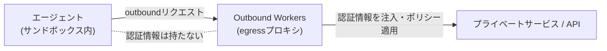

# Cloudflare Sandboxes

AI エージェント専用の永続的・隔離された実行環境。シェル・ファイルシステム・バックグラウンドプロセスを備えた「本物のコンピュータ」を、必要なときに起動し、中断した場所からそのまま再開できる。[[cloudflare-agents-week-2026]] で GA (一般提供) が発表された。

## 何を解決するか

記事が挙げている課題は次のようなもの。

- セッションごとにサンドボックスを起動する必要があるが、アイドル時の計算コストは避けたい
- セッション再開を高速にしたい
- エージェントに認証情報を安全に渡したい
- ライフサイクルやファイル操作をプログラムから制御したい
- 人間・エージェントの両方が扱えるシンプルなインターフェースにしたい

## GA 時点の機能

- **PTY サポート**: WebSocket 経由で xterm.js と連携する、本物のターミナルセッション
- **永続的なコードインタプリタ**: Python / JavaScript / TypeScript で状態を保持(Jupyter Notebook に近い)
- **バックグラウンドプロセス + プレビュー URL**: 開発サーバーを起動し、公開 URL を発行できる
- **ファイルシステム監視**: inotify ベースの変更検知ストリーム
- **スナップショット**: ディスク状態を R2 に保存し、素早く復元(記事の例ではウォームアップに 30秒かかっていたものが 2秒に短縮)

Cloudflare Containers を基盤としつつ、ターミナル・コード実行・バックグラウンドプロセス管理といった、より高レベルな抽象化を提供する製品という位置づけ。

## Outbound Workers for Sandboxes (egress 制御)

Sandboxes と同じタイミングで発表された、サンドボックスの outbound 通信を制御する仕組み。プログラマブルな egress プロキシが、ネットワークレイヤーで認証情報を注入する。エージェント自身は認証情報を一切持たず、代わりにプロキシ側のカスタムロジックでアクセスを制御できる。ゼロトラストな出力プロキシ、という説明がされている。



## 料金モデル

Active CPU Pricing に移行しており、アイドル時は課金されない。並行インスタンス数の目安として、標準プランで lite 型 15,000、basic 型 6,000、大型で 1,000 以上、といった数字が挙げられている。

## [[cloudflare-agents-week-2026]]の中での位置づけ

エージェントの実行環境(コンピュート)を扱う。ブラウザという実行環境に特化したものは [[kitesurf]] に分けた。

## 理解度チェック

```quiz
Sandboxes と Cloudflare Containers の関係は。
---
Sandboxes は Containers を基盤としつつ、ターミナル・永続コードインタプリタ・バックグラウンドプロセス管理といった、より高レベルな抽象化を提供する製品。
```

```quiz
Outbound Workers for Sandboxes が「エージェントに認証情報を持たせない」ことで何を実現しているか。
---
認証情報はネットワークレイヤーのegressプロキシ側で注入・管理されるので、信頼できないコードを動かすサンドボックス内に秘密情報が漏れる経路自体をなくせる。
```

## 出典

- [Agents have their own computers with Sandboxes GA](https://blog.cloudflare.com/sandbox-ga/)
- [Building the agentic cloud: everything we launched during Agents Week 2026](https://blog.cloudflare.com/agents-week-in-review/)

#cloudflare #agents-week-2026 #ai-agent #sandbox
