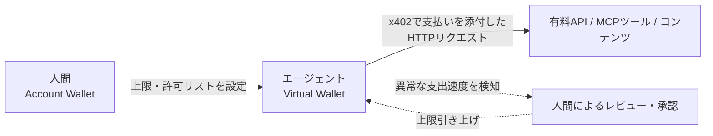

# Cloudflare Wallets

AI エージェントに支払い手段と検証可能な身元を持たせる仕組み。2026年8月4日、[[cloudflare-agents-week-2026]] の中で発表された。

解決しようとしている問題は、エージェントが人間向けの支払いフロー(ログイン、支払い方法の登録、API キー発行)に乗れないこと。エージェントは銀行口座を開けないし「Sign up with Google」もクリックできない。有料 API を叩く、データセットを買う、ツールに支払う、といった行為をするための安定した識別子も支払い手段も持たない。

## 2種類のウォレット

| 種類 | 所有者 | できること |
| --- | --- | --- |
| Account Wallet | 人間 | 入金、Virtual Wallet への支出委譲、出金 |
| Virtual Wallet | エージェント | API 経由で、Account Wallet 所有者が設定した上限の中でのみ支出 |

Virtual Wallet はエージェントに「動く自由」を与えつつ、使いすぎを防ぐための仕組みという位置づけ。

## 支払いの仕組み: x402

Monetization Gateway が x402 プロトコル(HTTP リクエストに支払いを添付できる仕組み)を採用している。Cloudflare Wallets は x402 対応エンドポイントへの支払いを実現するインフラとして動く。



## cloudflare.pay ハンドル

ウォレットに紐づく人間可読な識別子。たとえば `research.example.cloudflare.pay` のように名乗れる。マーチャント側は「どの組織のエージェントか」を認識できる。身元開示は任意。

## ガードレール

- 支出上限(例: 従業員ごとに週 $100)
- 許可リスト
- 1回あたりの最大トランザクション額
- 異常な支出速度を検知したら、承認済みの人間がレビュー・承認・上限引き上げを行う

小額の上限(例 $10)で数十〜数百のサービスを試せる、という使い方も紹介されている。

## 発表時点での提供状況

2026年8月4日の発表時点では、Cloudflare Wallet のハンドル取得はすぐにできる状態。一方で支払い機能自体は記事中で "soon" と表現されており、本格的な提供はまだ先だった。関連するインフラとして Turnstile・Bot Management・Web Bot Auth への言及がある(エージェントかどうかの検証に使う想定と読める)。

## [[cloudflare-agents-week-2026]]の中での位置づけ

エージェントの経済活動(支払いと身元)を扱う。実行環境そのものは [[cloudflare-sandboxes]]、外部ツール呼び出しの安全性は [[mcp-v2]] や [[webmcp]] が別の角度から扱っている。

## 理解度チェック

```quiz
Account Wallet と Virtual Wallet の違いは何か。
---
Account Wallet は人間の所有者用で入出金ができる。Virtual Wallet はエージェント用で、Account Wallet 所有者が事前に設定した上限の中でしか支出できない。
```

```quiz
2026年8月4日の発表時点で、Cloudflare Wallets はどこまで使えたか。
---
ウォレットハンドルの取得はできたが、支払い機能そのものは記事中で「もうすぐ」とされており、本格提供はまだだった。
```

```quiz
cloudflare.pay ハンドルは何のためにあるか。
---
エージェントに人間可読な識別子を与え、支払い相手のマーチャントが「どの組織のエージェントからのアクセスか」を認識できるようにするため。身元開示自体は任意。
```

## 出典

- [Announcing Cloudflare Wallets: the programmable wallet for the agentic Internet](https://blog.cloudflare.com/wallets/)
- [Welcome to Agents Week](https://blog.cloudflare.com/agents-week-welcome/)

#cloudflare #agents-week-2026 #ai-agent
