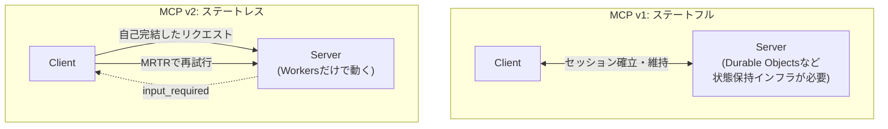

# MCP v2

Model Context Protocol (MCP) の 2026-07-28 仕様で導入された、プロトコルコアのステートレス化。Cloudflare は2026年8月6日、[[cloudflare-agents-week-2026]] の中でこの仕様への対応を発表した。MCP 自体は Anthropic が考案し、Agentic AI Foundation に寄贈した標準で、Cloudflare は実装パートナーとしてこの仕様策定と SDK 改善に関わっている。

## これまでの課題

従来の MCP はクライアントとサーバー間の**ステートフルな接続**を前提としていた。オートスケーリングするインフラの側で、アクティブなセッションを保持し続ける必要があり、セッション管理・リクエストルーティング・メッセージのリプレイといった運用負荷が大きかった。

## v2 での変更

プロトコルコアから、必須のハンドシェイク・`Mcp-Session-Id` ヘッダー・セッションという概念そのものを取り除いた。各リクエストが自己完結し、プロトコルセッションを保持し続ける必要がなくなった。

人間の確認が必要な場面は、サーバーが `input_required` という結果を返し、クライアントが再試行する **Multi Round-Trip Requests (MRTR)** という方式に置き換えられている。



この結果、MCP サーバーは Durable Objects のような状態管理インフラなしに、リクエストスコープのインフラ(Cloudflare Workers など)だけで動くようになった。運用がシンプルになり、コストも下がるとされている。

## 対応 SDK と移行

TypeScript・Python・Go・C# の SDK が 2026-07-28 仕様に対応済み。既存実装は、新しいステートレスなルートを既存のステートフルなルートと並行運用しながら段階的に移行できる。MCP SDK v2 の移行ガイドが用意されている。

## [[cloudflare-agents-week-2026]]の中での位置づけ

MCP プロトコルそのものの変更を扱う。サイトをエージェントから使えるようにする応用側の話は [[webmcp]] に分けた。

## 理解度チェック

```quiz
MCP v2 で「セッション」という概念はどうなったか。
---
プロトコルコアから、必須ハンドシェイク・`Mcp-Session-Id` ヘッダー・セッションの概念そのものが取り除かれた。各リクエストが自己完結するステートレスなプロトコルになった。
```

```quiz
MCP v2 で人間の確認が必要な場面はどう扱われるか。
---
サーバーが `input_required` という結果を返し、クライアントが再試行する Multi Round-Trip Requests (MRTR) という方式で扱う。セッションを維持する代わりに、やり取りそのものを往復させる。
```

```quiz
MCP v2 移行で MCP サーバーの実行基盤に起きた変化は。
---
Durable Objects のような状態管理インフラが不要になり、Cloudflare Workers のようなリクエストスコープのインフラだけで動かせるようになった。
```

## 出典

- [The next generation of MCP](https://blog.cloudflare.com/mcp-v2/)
- [Everything we launched during Agents Week](https://blog.cloudflare.com/agents-week-review-august-2026/)

#cloudflare #agents-week-2026 #mcp
