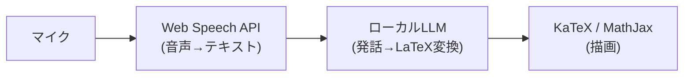

# オンデバイス Gemini / Gemma の音声入力対応状況

Google のオンデバイス系モデルで音声入力を受けられるのは、Chrome 内蔵の Gemini Nano(Prompt API 経由)と、オープンウェイトの Gemma 3n の2系統。2026年8月時点では、どちらも「仕様・アーキテクチャ上は音声対応、実際に使える経路は限定的」という状態。

## Chrome Prompt API(Gemini Nano)

Prompt API は仕様上テキスト・画像・音声のマルチモーダル入力に対応していて、セッション作成時の `expectedInputs` に `audio` を指定する。マルチモーダル入力は `chrome://flags/#prompt-api-for-gemini-nano-multimodal-input` を有効にして使う建て付け。

ただし実態は不安定で、2026年1月には「Chrome 143 で関連フラグをすべて有効にしても、音声ケイパビリティが JavaScript に公開されず `NotAllowedError: Model capability is not available` になる」という報告が Chromium の開発者フォーラムに出ている。動くバージョンと動かないバージョンがある実験段階と見ておくのが正確。

## Gemma 3n

音声エンコーダをアーキテクチャに内蔵したマルチモーダルモデルで、音声の文字起こしと翻訳がネイティブにできる。ローンチ時点のエンコーダ実装が一度に処理できるのは約30秒までのクリップ。

実行経路ごとの対応はばらつきがある。

- MediaPipe LLM Inference API / Google AI Edge — Android でのオンデバイス実行に対応。ただし公開プレビュー段階では音声機能がまだ使えない構成があった
- Ollama — `gemma3n` はテキストのみで、画像・音声入力に未対応
- mlx-vlm — 音声ファイルを渡して文字起こしできる

## 考察: 音声で数式を入力する構成

音声で数式入力をやるなら、LLM に音声を直接食わせる必要はなく、音声認識と数式変換を分離した方が今は堅い。



この構成なら音声対応が不安定な Gemini Nano でもテキスト専用として使える。将来 Prompt API の音声入力が安定したら、前段2つを統合して発話ニュアンス(「ぶんの」の区切りなど)を音声ごと解釈させる進化パスも取れる。

## 理解度チェック

```quiz
Prompt API が仕様上受け付けるマルチモーダル入力は何か。
---
テキスト・画像・音声の3種類。`expectedInputs` で指定する。
```

```quiz
2026年初頭時点で、Chrome の Prompt API で音声入力を使おうとすると何が起きたか。
---
Chrome 143 では関連フラグをすべて有効にしても音声ケイパビリティが JS に公開されず、`NotAllowedError` になる報告があった。
```

```quiz
Gemma 3n の音声エンコーダが一度に処理できるクリップ長は(ローンチ時点の実装で)どのくらいか。
---
約30秒まで。
```

## 出典

- [The Prompt API | Chrome for Developers](https://developer.chrome.com/docs/ai/prompt-api)
- [Join the Prompt API origin trial(マルチモーダル)](https://developer.chrome.com/blog/prompt-multimodal-origin-trial)
- [Error enabling Audio in Chrome Prompt API(chromium.org フォーラム)](https://groups.google.com/a/chromium.org/g/chrome-ai-dev-preview-discuss/c/mL_abJ_sTr0/m/_ZQXRYbdEwAJ)
- [Introducing Gemma 3n: The developer guide(Google Developers Blog)](https://developers.googleblog.com/en/introducing-gemma-3n-developer-guide/)
- [Audio understanding | Gemma | Google AI for Developers](https://ai.google.dev/gemma/docs/capabilities/audio)
- [Gemma 3n(Simon Willison による解説)](https://simonwillison.net/2025/Jun/26/gemma-3n/)
- [ollama.com/library/gemma3n](https://ollama.com/library/gemma3n)

#chrome #llm #音声
