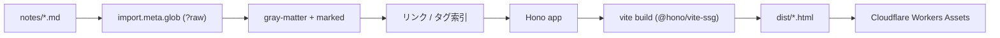

# notes.kobaken.co の構成

このサイト自体の作り。Markdown で書いたノートを [[hono-ssg|Hono の SSG ヘルパー]] で静的 HTML にして、Cloudflare Workers の静的アセットとして配信している。運用の方針としては [[evergreen-notes]] に従う。

## 全体像



## ディレクトリ

- `notes/*.md` — ノートのソース。ファイル名の kebab-case がそのまま URL の slug になる
- `src/lib/notes.ts` — 全ノートを読み込み、リンク・バックリンク・タグの索引を組み立てる
- `src/lib/markdown.ts` — marked の拡張。`[[wikilink]]` と `#tag` の解釈、shiki によるハイライト
- `src/index.tsx` — ルーティング
- `src/styles.ts` — CSS（各ページに `<style>` としてインライン展開される）

ノートの読み込みは Vite の `import.meta.glob` を使っていて、ビルド時にすべての Markdown がバンドルに取り込まれる。実行時にファイルシステムを読まないので、そのまま Workers 上でも動く形になっている。

## リンクとタグ

`[[slug]]` でノート同士をリンクする。`[[slug|表示テキスト]]` で表示を変えられる。存在しない slug を指定した場合はビルド時に警告が出て、本文では点線のグレー表示になる。リンクされた側には自動でバックリンクが表示される。

`#tag` は本文中に直接書く。英字タグは小文字に正規化され、日本語タグはそのまま扱われる。`C#` や URL のフラグメントを誤認しないよう、直前が英数字の `#` はタグとして扱わない。

## ビルドとデプロイ

```sh
bun run dev      # Vite dev server
bun run build    # dist/ に静的ファイルを生成
bun run deploy   # ビルドして wrangler deploy
```

`main` を持たない静的アセットのみの Worker として動いていて、`wrangler.jsonc` の `routes` で `notes.kobaken.co` に紐付けている。

#hono #cloudflare #meta
