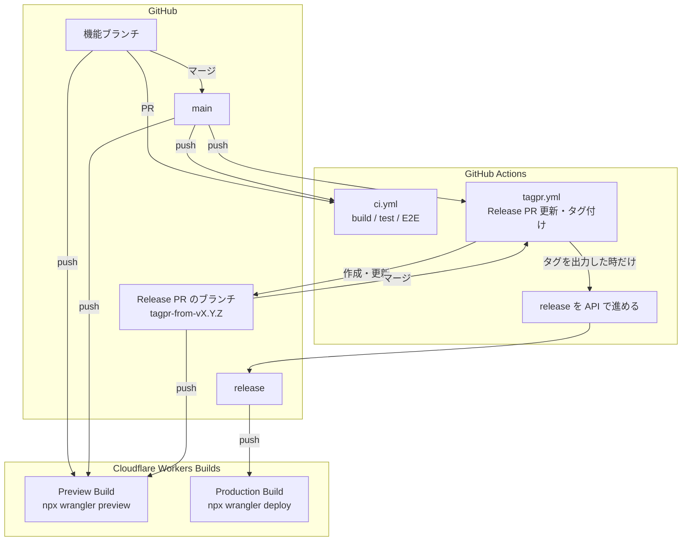

# tagpr と Workers Builds で組む、本番とプレビューのデプロイ構成

[[tagpr]]・[[cloudflare-workers-builds|Workers Builds]]・[[cloudflare-worker-previews|Worker Previews]] を組み合わせて、1つの Worker で本番とプレビューを運用する構成。

- **本番**：tagpr が用意する Release PR をマージした時だけデプロイされる。普段 main にマージしても本番には出ない。
- **プレビュー**：`release` 以外のすべてのブランチが、push のたびにブランチごとの Preview になる。本番とは別枠で、昇格して本番に出ることはない。

GitHub には Cloudflare の認証情報を一切置かない。デプロイはすべて Cloudflare 側の Git 連携（Workers Builds）が行い、GitHub Actions はテストとリリースの管理だけを受け持つ。

## 全体像



| ブランチ | Workers Builds の動き | 行き先 |
| --- | --- | --- |
| 機能ブランチ | Preview Build | `<branch>-<worker>.<subdomain>.workers.dev` |
| `main` | Preview Build | `main-<worker>.<subdomain>.workers.dev`（次のリリースに入る内容） |
| Release PR のブランチ | Preview Build | これから本番に出る内容そのもの（main + version bump + CHANGELOG） |
| `release` | Production Build | 本番のカスタムドメイン |

| 役割 | 担当 | きっかけ |
| --- | --- | --- |
| テスト | GitHub Actions（`ci.yml`） | PR と main への push |
| Release PR の維持とタグ付け | GitHub Actions（tagpr） | main への push |
| `release` を進める | GitHub Actions（tagpr の後続ジョブ） | tagpr がタグを出力した時だけ |
| 本番デプロイ | Workers Builds（Production branch = `release`） | `release` への push |
| プレビューのデプロイ | Workers Builds（Preview Builds） | `release` 以外への push |

## Workers Builds の設定

ダッシュボードの Worker → Settings → Builds で、1つの Git 連携に本番とプレビューの両方を持たせる。

| 項目 | 値 | 意味 |
| --- | --- | --- |
| Production branch | `release` | 本番デプロイのきっかけになるブランチ |
| Build command | 例：`bun run build` | 本番・プレビューのどちらでも最初に走る |
| Deploy command | `npx wrangler deploy`（既定） | 本番だけで走る |
| Enable Preview Builds | ON | `release` 以外への push で Preview Build を走らせる |
| Preview command | `npx wrangler preview`（既定） | プレビューだけで走る |

- Worker Previews より前から Builds を使っている Worker は、「Switch to Worker Previews」で一度だけ切り替える。**元に戻せない。** 切り替える前の既定は `npx wrangler versions upload` で、本番と同じバインディングを使う Version URL ができるだけだった。
- Preview command を独自のものにするときも、`wrangler preview` を直接呼ぶ形にする。ダイアログに「Custom commands must invoke `npx wrangler preview`」と出る。`bunx wrangler preview` でも通った。
- Workers Builds は、`package.json` に書かれた wrangler のバージョンを使う。Worker Previews には 4.135.0 以上が要るので、依存に wrangler が無ければ追加する。

## wrangler 設定：本番とプレビューを1つのファイルに書く

```jsonc
{
  "name": "my-worker",
  "main": "server.tsx",
  "compatibility_date": "2025-01-01",
  "assets": { "directory": "./public" },

  // ---- 本番 ----
  "routes": [{ "pattern": "app.example.com", "custom_domain": true }],
  "workers_dev": false,
  "observability": { "enabled": true },

  // ---- プレビュー ----
  // workers_dev: false だと既定で false になるので、明示的に ON にする
  "preview_urls": true,
  "previews": {
    // 本番の設定は継承しない。バインディングや vars もここに書く
    "observability": {
      "enabled": true,
      "logs": { "enabled": true, "invocation_logs": true },
      "traces": { "enabled": true, "head_sampling_rate": 1 }
    }
  }
}
```

### 本番側

- `routes` の `custom_domain: true` で、デプロイ時に DNS レコードと証明書が自動で用意される（ゾーンが同じアカウントにあること）。
- `workers_dev: false` にして、本番を workers.dev では出さない。
- トップレベルの `observability` で、本番のログを Workers Logs に残す。これを書かないと、`wrangler tail` を張り付けている間しかエラーの詳細を追えない。

### プレビュー側

- `preview_urls: true` が無いと、ビルドは成功しても Preview URL ができない（`workers_dev: false` の値を継承するため）。
- **`previews` ブロックは本番の設定を継承しない。** 本番にバインディングを足したら、プレビューでも使うものは `previews` にも書く。書き忘れると、プレビューだけ `env.X` が undefined になり 1101 エラーになる。
- `previews.observability` で、ログとトレースがプレビューごとに分かれる。ダッシュボードの Worker → Previews → ブランチ名 → Observability で見る。本番の Workers Logs には混ざらない。`wrangler tail` はプレビューに使えない。
- Preview URL は既定で誰でも見られる。関係者だけに見せるなら、`*-<worker>.<subdomain>.workers.dev` のワイルドカードを Cloudflare Access で保護する。
- D1 や R2 はプレビューごとに自動では分かれない。プレビュー用のリソースを別に作って `previews` から指す（詳しくは [[cloudflare-worker-previews]]）。

## 本番デプロイの仕組み

### Workers Builds は push にしか反応しない → 専用の `release` ブランチ

Workers Builds のきっかけは push だけで、「タグが打たれたら」は指定できない。Production branch を `main` にすると、main へのマージがすべて本番に出てしまう。

そこで、人間が直接触らない `release` ブランチを Production branch にし、**リリースが確定した瞬間だけ Actions でそのブランチを進める**。Workers Builds から見れば「`release` に push が来た＝リリース」になる。

### tagpr がタグを出した時だけ `release` を進める

tagpr は Release PR をマージした時だけ、`outputs.tag` にタグ名を出す。普段の main への push（Release PR の追従更新だけ）では空になる。後続のジョブを `if: needs.tagpr.outputs.tag != ''` で条件付けすれば、リリースの時にだけ `release` が動く。

```yaml
jobs:
  tagpr:
    outputs:
      tag: ${{ steps.tagpr.outputs.tag }}
    # … Songmu/tagpr を実行

  advance-release-branch:
    needs: tagpr
    if: needs.tagpr.outputs.tag != ''
    permissions:
      contents: write
    steps:
      - run: |
          sha=$(gh api "repos/$GITHUB_REPOSITORY/commits/$TAG" --jq .sha)
          gh api -X PATCH "repos/$GITHUB_REPOSITORY/git/refs/heads/release" \
            -f sha="$sha" -F force=false
```

`git push` ではなく GitHub API で進めるのは、浅いチェックアウトでも fast-forward の判定をサーバー側に任せられるから。まだ `release` が無いときは `POST /git/refs` で作る。詳しくは [[github-api-ref-update]]。

### `GITHUB_TOKEN` の push でも Workers Builds は動く

[[github-token-does-not-trigger-workflows|`GITHUB_TOKEN` で行った push は、他のワークフローを起動しない]]。それでもこの構成が成り立つのは、Workers Builds が **GitHub Actions のワークフローではなく、GitHub App の push webhook で動いている**から。この制限は Actions のワークフロー実行に対するもので、webhook の配信は止めない。そのため PAT も GitHub App のトークンも要らず、`GITHUB_TOKEN` だけで本番デプロイまでつながる。

実際に次の2つを確認している。

- このワークフローで `release` を進めると、本番デプロイが走る。
- tagpr が `GITHUB_TOKEN` で push した Release PR のブランチ（`tagpr-from-v0.1.1` など）にも、「Workers Builds」のチェックが付いてビルドされる。

## プレビューの仕組み

Workers Builds では、Production branch 以外への push はすべて Preview Build になる。Preview command の `wrangler preview` は、ビルド環境変数 `WORKERS_CI_BRANCH` のブランチ名から Preview の名前を決める。同じブランチに push すれば同じ Preview が更新され、PR には Preview URL のコメントが付く。

この構成では、次の3種類のブランチがそれぞれ Preview を持つ。

- **機能ブランチ**：レビュー用。
- **main**：次のリリースに入る内容。マージが溜まった状態を、リリース前に通しで確かめられる。
- **Release PR のブランチ**：main に version bump と CHANGELOG を足しただけ。これから本番に出る内容そのものを、マージの前に確かめられる。

Preview はあくまで別枠の環境なので、**Preview を確かめても、本番へは Release PR のマージでしか出ない。** 以前の Version URL 方式のように、プレビューのバージョンを誤って昇格させる経路がない。

## この構成で気をつけること

- **Workers Builds のチェックと Actions の CI は別物。** PR には「Workers Builds: <Worker名>」のチェックが付くが、これはビルドとデプロイが通ったというだけ。テストは Actions 側で走らせ、どちらも通ってからマージする。
- **ロールバックはダッシュボードで。** Cloudflare のダッシュボードの Deployments から前のデプロイに戻す。`release` ブランチは触らなくてよく、次のリリースでは普通に進む。
- **Cron Triggers はプレビューで動かない。** 本番だけが対象で、Preview の `scheduled()` は呼ばれない（[[cloudflare-worker-previews]]）。

## 理解度チェック

```quiz
Workers Builds の Production branch を `main` ではなく専用の `release` ブランチにするのはなぜか。
---
Workers Builds は push にしか反応せず、タグ付けをきっかけにできないため。`main` にすると、main へのマージがすべて本番に出てしまう。
```

```quiz
`GITHUB_TOKEN` で行った push は他のワークフローを起動しないのに、`release` を進めると本番デプロイが走るのはなぜか。
---
Workers Builds は Actions のワークフローではなく、GitHub App の push webhook で動いているため。`GITHUB_TOKEN` の制限はワークフロー実行に対するもので、webhook の配信は止めない。
```

```quiz
`workers_dev: false` の Worker で、プレビューのビルドは成功するのに Preview URL ができない。何が足りないか。
---
トップレベルの `preview_urls: true`。`preview_urls` は既定で `workers_dev` の値を継承するので、明示しないと false になる。
```

```quiz
Release PR のブランチにも Preview ができることには、どんな使い道があるか。
---
Release PR は main に version bump と CHANGELOG を足しただけなので、これから本番に出る内容そのものを、マージの前に Preview で確かめられる。
```

## 出典

- [Songmu/tagpr](https://github.com/Songmu/tagpr)
- [Build branches · Workers Builds](https://developers.cloudflare.com/workers/ci-cd/builds/build-branches/)
- [Build configuration · Workers Builds](https://developers.cloudflare.com/workers/ci-cd/builds/configuration/)
- [Previews · Cloudflare Workers docs](https://developers.cloudflare.com/workers/previews/)
- [Triggering a workflow from a workflow · GitHub Docs](https://docs.github.com/en/actions/writing-workflows/choosing-when-your-workflow-runs/triggering-a-workflow#triggering-a-workflow-from-a-workflow)
- [Git References · GitHub REST API docs](https://docs.github.com/en/rest/git/refs)

#cloudflare #workers #ci-cd #github #リリース
