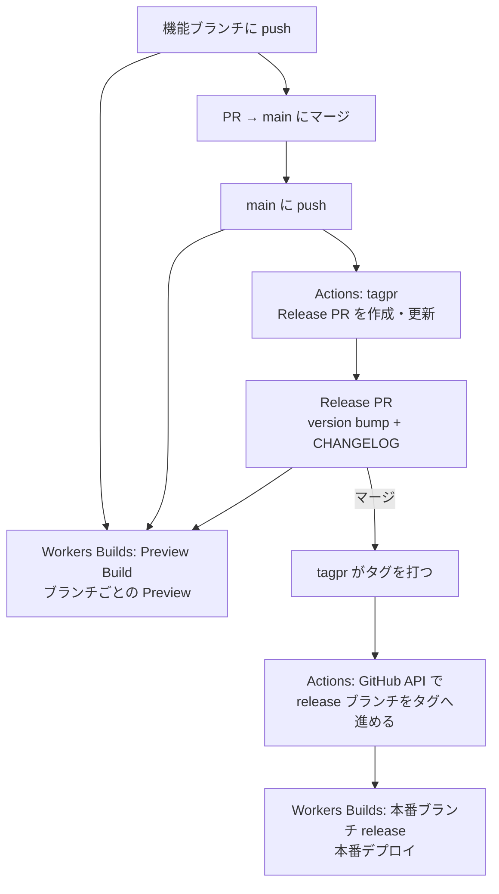

# tagpr と Workers Builds で「Release PR のマージ＝本番リリース」を組む

[[tagpr]]・[[cloudflare-workers-builds|Workers Builds]]・[[cloudflare-worker-previews|Worker Previews]] を組み合わせて、次の運用にする構成。

- 普段は main にマージするだけ。本番には出ない。
- tagpr が用意する Release PR をマージした時だけ、本番にデプロイされる。
- それ以外のブランチは、push するたびにブランチごとの Preview になる。

GitHub には Cloudflare の認証情報を一切置かない。デプロイはすべて Cloudflare 側の Git 連携が行い、GitHub Actions はテストとリリースの管理だけを受け持つ。

## 全体の流れ



| 役割 | 担当 | きっかけ |
| --- | --- | --- |
| テスト（build・unit・E2E） | GitHub Actions（`ci.yml`） | PR と main への push |
| Release PR の維持とタグ付け | GitHub Actions（tagpr） | main への push |
| `release` ブランチを進める | GitHub Actions（tagpr と同じワークフロー内の後続ジョブ） | tagpr がタグを出力したときだけ |
| 本番デプロイ | Workers Builds（Production branch = `release`） | `release` への push |
| ブランチごとの Preview | Workers Builds（Preview Builds） | `release` 以外への push |

## 部品ごとの役割

### Workers Builds は push にしか反応しない → 専用の `release` ブランチ

Workers Builds のトリガーは push だけで、「タグが打たれたら」は指定できない。Production branch を `main` にすると、main へのマージがすべて本番に出てしまう。

そこで、人間が直接触らない `release` ブランチを Production branch にし、**リリースが確定した瞬間だけ Actions でそのブランチを進める**。これで、Workers Builds から見ると「`release` に push が来た＝リリース」になる。

### tagpr がタグを出した時だけ `release` を進める

tagpr は Release PR をマージしたときだけ、`outputs.tag` にタグ名を出す。普段の main への push（Release PR の追従更新だけ）では空になる。後続のジョブを `if: needs.tagpr.outputs.tag != ''` で条件付けすれば、リリースの時にだけ `release` が動く。

```yaml
jobs:
  tagpr:
    outputs:
      tag: ${{ steps.tagpr.outputs.tag }}
    # … Songmu/tagpr を実行

  advance-release-branch:
    needs: tagpr
    if: needs.tagpr.outputs.tag != ''
    permissions:
      contents: write
    steps:
      - run: |
          sha=$(gh api "repos/$GITHUB_REPOSITORY/commits/$TAG" --jq .sha)
          gh api -X PATCH "repos/$GITHUB_REPOSITORY/git/refs/heads/release" \
            -f sha="$sha" -F force=false
```

`git push` ではなく GitHub API で進めるのは、浅いチェックアウトでも fast-forward の判定をサーバー側に任せられるから。詳しくは [[github-api-ref-update]]。`force=false` なので、`release` を巻き戻すような更新は拒否される。

### `GITHUB_TOKEN` の push でも Workers Builds は動く

[[github-token-does-not-trigger-workflows|`GITHUB_TOKEN` で行った push は、他のワークフローを起動しない]]。それでもこの構成が成り立つのは、Workers Builds が **GitHub Actions のワークフローではなく、GitHub App の push webhook で動いている**から。この制限は Actions のワークフロー実行に対するもので、webhook の配信は止めない。そのため PAT も GitHub App のトークンも要らず、`GITHUB_TOKEN` だけで本番デプロイまでつながる。

実際に次の2つを確認している。

- このワークフローで `release` を進めると、本番デプロイが走る。
- tagpr が `GITHUB_TOKEN` で push した Release PR のブランチ（`tagpr-from-v0.1.1` など）にも、「Workers Builds」のチェックが付いてビルドされる。

### `release` 以外はすべて Preview

Workers Builds では、Production branch 以外への push はすべて Preview Build になる。つまり次の3種類のブランチが、どれもブランチごとの Preview を持つ。

- **機能ブランチ**：レビュー用。
- **main**：次のリリースに入る内容の Preview。
- **tagpr の Release PR のブランチ**：main に version bump と CHANGELOG を足しただけのブランチ。これから本番に出る内容そのものを、マージの前に Preview で確かめられる。

Preview は本番の設定を継承しないので、バインディングは `previews` ブロックに書いておく（[[cloudflare-worker-previews]]）。

## この構成で気をつけること

- **Workers Builds のチェックは PR に付くが、Actions の CI とは別物。** PR には「Workers Builds: <Worker名>」というチェックが付くが、テストは Actions 側で走らせる。どちらも通ってからマージする。
- **本番に出るのは `release` を進めた時だけ。** 急ぎのロールバックは、Cloudflare のダッシュボードの Deployments から前のデプロイに戻す。`release` ブランチは触らなくてよく、次のリリースでは普通に進む。
- **`release` を最初に作るのも API で行う。** まだブランチが無いときは `PATCH` ではなく `POST /git/refs` で作る（[[github-api-ref-update]]）。

## 理解度チェック

```quiz
Workers Builds の Production branch を `main` ではなく専用の `release` ブランチにするのはなぜか。
---
Workers Builds は push にしか反応せず、タグ付けをきっかけにできないため。`main` にすると、main へのマージがすべて本番に出てしまう。
```

```quiz
`GITHUB_TOKEN` で行った push は他のワークフローを起動しないのに、`release` を進めると本番デプロイが走るのはなぜか。
---
Workers Builds は Actions のワークフローではなく、GitHub App の push webhook で動いているため。`GITHUB_TOKEN` の制限はワークフロー実行に対するもので、webhook の配信は止めない。
```

```quiz
tagpr の Release PR のブランチにも Preview ができることには、どんな使い道があるか。
---
Release PR は main に version bump と CHANGELOG を足しただけなので、これから本番に出る内容そのものを、マージの前に Preview で確かめられる。
```

## 出典

- [Songmu/tagpr](https://github.com/Songmu/tagpr)
- [Build branches · Workers Builds](https://developers.cloudflare.com/workers/ci-cd/builds/build-branches/)
- [Previews · Cloudflare Workers docs](https://developers.cloudflare.com/workers/previews/)
- [Triggering a workflow from a workflow · GitHub Docs](https://docs.github.com/en/actions/writing-workflows/choosing-when-your-workflow-runs/triggering-a-workflow#triggering-a-workflow-from-a-workflow)
- [Git References · GitHub REST API docs](https://docs.github.com/en/rest/git/refs)

#cloudflare #workers #ci-cd #github #リリース
