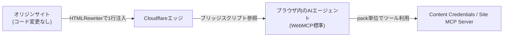

# WebMCP

ブラウザ内で動く AI エージェントが、サイトを直接操作できるようにするための新しいブラウザ標準。Cloudflare 発の仕様ではなく、Chrome 146 で実験的に提供が始まっている業界標準で、Cloudflare は2026年8月6日、[[cloudflare-agents-week-2026]] の中でこの標準への対応を発表した。

## 何を解決するか

従来、AI エージェントはクローラーとしてページを取得し、内容をサーバー側にコピーしていた。この方式では元のサイトにトラフィックが戻ってこないことが多い。WebMCP は、エージェントがブラウザの中でサイトと直接連携できるようにすることで、サイト側がトラフィックと利用の帰属("credit")を保てるようにする仕組み。

## Cloudflare の実装

Cloudflare は「標準の両端」、つまりサイト側の実装とエージェント側の利用の両方を作っていると説明している。サイト運営者向けには、ダッシュボードの Agent Readiness > WebMCP でドメインごとにトグルを ON にするだけで有効化できる。オリジン側のコード変更は不要。

仕組みは HTMLRewriter を使い、エッジで HTML レスポンスに1行だけコードを注入する(同一オリジンの小さなブリッジスクリプトへの参照)。既存の HTML 自体は書き換えない。静的サイトでも SPA でも同じ方法で動く。

## pack という単位

有効化する機能は「pack」という単位でまとめられている。pack は「一緒にオンにできる関連ツールのグループ」。発表時点では Content Credentials と Site MCP Server の2種類が提供されている。サイトは redeploy せずに、追加の pack を後からオンにしていける設計。



発表時点では developer preview 段階で、一般提供(GA)ではない。

## [[cloudflare-agents-week-2026]]の中での位置づけ

サイト側からエージェントを迎え入れる仕組みを扱う。エージェント側からWebを見に行く手段は [[kitesurf]]、プロトコルの下回りの変更は [[mcp-v2]] に分けた。

## 理解度チェック

```quiz
WebMCP という標準そのものは Cloudflare が作ったものか。
---
いいえ。Chrome 146 で実験的に提供が始まっている業界標準。Cloudflare はサイト側の実装を簡略化する仕組みを提供している。
```

```quiz
WebMCP を有効化するのに、サイトのコードや配信構成を変更する必要はあるか。
---
不要。ダッシュボードでドメインごとにトグルをオンにするだけで、エッジ側がHTMLRewriterでレスポンスに1行注入する。オリジンの変更は要らない。
```

## 出典

- [Give any website a WebMCP interface](https://blog.cloudflare.com/webmcp/)
- [Everything we launched during Agents Week](https://blog.cloudflare.com/agents-week-review-august-2026/)

#cloudflare #agents-week-2026 #mcp
